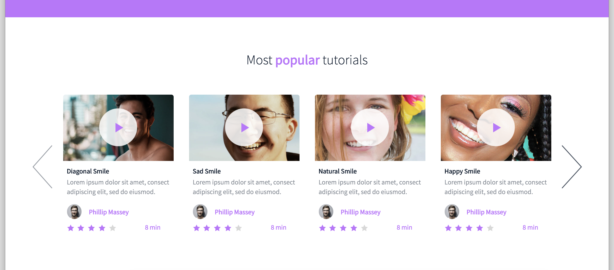

In this project, you will implement 3 web pages with Bootstrap. You will use all HTML/CSS/Accessibility/Responsive design/Bootstrap knowledges that you learned previously.

You won’t have a lot of instruction, you are free to implement it the way that you want - the objective is simple: Have fully functional web pages that look the same as the designer file.

Here the final result:


# Requirements

- You have to use Bootstrap
- Your styles.css must be as small as you can - you must use as much as you can Bootstrap classes

# Imports

For this project, you will need: fonts from Google, JQuery, Bootstrap CSS/JS

```sh
<link href="https://fonts.googleapis.com/css?family=Source+Sans+Pro&display=swap" rel="stylesheet">
<link href="https://fonts.googleapis.com/css?family=Coiny&display=swap" rel="stylesheet">

<script src="https://code.jquery.com/jquery-3.4.1.min.js" integrity="sha256-CSXorXvZcTkaix6Yvo6HppcZGetbYMGWSFlBw8HfCJo=" crossorigin="anonymous"></script>
<script src="https://stackpath.bootstrapcdn.com/bootstrap/4.4.1/js/bootstrap.min.js" integrity="sha384-wfSDF2E50Y2D1uUdj0O3uMBJnjuUD4Ih7YwaYd1iqfktj0Uod8GCExl3Og8ifwB6" crossorigin="anonymous"></script>
<script src="https://cdnjs.cloudflare.com/ajax/libs/popper.js/1.12.9/umd/popper.min.js" integrity="sha384-ApNbgh9B+Y1QKtv3Rn7W3mgPxhU9K/ScQsAP7hUibX39j7fakFPskvXusvfa0b4Q" crossorigin="anonymous"></script>

<link rel="stylesheet" href="https://stackpath.bootstrapcdn.com/bootstrap/4.4.1/css/bootstrap.min.css" integrity="sha384-Vkoo8x4CGsO3+Hhxv8T/Q5PaXtkKtu6ug5TOeNV6gBiFeWPGFN9MuhOf23Q9Ifjh" crossorigin="anonymous">
```

# Tasks


**0. Read and be familiar with Figma**

Files: [README.md](README.md/)

Create an account in Figma and open these files:

- [Homepage - fig file](https://www.figma.com/file/QYQqMYbdpAHL5xTclwJKSI/Homepage)
- [Pricing - fig file](https://www.figma.com/file/KLAI53jdYpfFNEy0O79ymB/Pricing)
- [Courses - fig file](https://www.figma.com/file/ivg3abH1HLmMayBgjGg1Qf/Courses)

And “Duplicate to your Drafts” to have access to all design details.

Important notes with Figma:

- if your computer doesn’t have missing fonts, you can find them here: source-sans-pro and Spin-Cycle-OT
- some values are in float - feel free to round them
- “Be pixel perfect” - yes! but mainly make sure colors, size and position are correct. #C271FF is not purple.

For this task, please write an amazing README.md

**Interactions note:**

- Web pages must switch to the tablet version when the screen width is 768px
- Web pages must switch to the mobile version when the screen width is 576px
- button hover/active: opacity: 0.9


**1. Header first**

Files: [0-homepage.html](0-homepage.html/) - [styles.css](styles.css/)

Let’s start by the Homepage: create the header/hero piece

Here an archive of all assets needed (for the entire project):

- [images_images.zip](https://intranet.hbtn.io/rltoken/LXJM1BKGUrHol3Nzu48eEQ)
- [holberton_school-icon.zip](https://intranet.hbtn.io/rltoken/CqKyRZebdi_xnT32SSNdWg)


Desktop:


Mobile:


**2. Carousel of quotes**

Files: [1-homepage.html](1-homepage.html/) - [styles.css](styles.css/)

Create the section “Carousel of quotes”

By using a Carousel component of Bootstrap, create this Carousel of quotes.

You can have for the moment one quote or twice the same for testing (like example below)


**3. Popular videos**

Files: [2-homepage.html](2-homepage.html/) - [styles.css](styles.css/)

Create the section “Most popular tutorials”

By using a Carousel component of Bootstrap, create this Carousel of video cards.

Reminder:

- Desktop: 4 cards
- Tablet: 2 cards
- Mobile: 1 card




**4. Row of smiles**

Files: [3-homepage.html](3-homepage.html/) - [styles.css](styles.css/)

Create the section “Free membership”


**5. Latest videos**

Files: [4-homepage.html](4-homepage.html/) - [styles.css](styles.css/)

Create the section “Latest videos”

Copy the block “Most popular tutorials” to “Latest videos”


**6. ... and the footer!**

Files: [homepage.html](homepage.html/) - [styles.css](styles.css/)

Create the footer


**7. Pricing - header**

Files: [0-pricing.html](0-pricing.html/) - [styles.css](styles.css/)

Now, let’s do the pricing page: create the header/hero piece

The mobile version must be the same as the Homepage - it’s time to reuse code!

Desktop:


**8. Prices grid**

Files: [1-pricing.html](1-pricing.html/) - [styles.css](styles.css/)

Create the prices grid

Desktop:


Mobile:


**9. Quotes section**

Files: [2-pricing.html](2-pricing.html/) - [styles.css](styles.css/)

Same as the Homepage, create the Carousel of quotes


**10. FAQ**

Files: [3-pricing.html](3-pricing.html/) - [styles.css](styles.css/)

Create the FAQ grid

Desktop:


Mobile:


**11. Close the page with a footer**

Files: [pricing.html](pricing.html/) - [styles.css](styles.css/)

Same as Homepage, create the footer


**12. Courses - header**

Files: [0-courses.html](0-courses.html/) - [styles.css](styles.css/)

Now, let’s do the courses page: create the header/hero piece

The mobile version must be the same as the Homepage - it’s time to reuse code!

Desktop:


**13. Search filters**

Files: [1-courses.html](1-courses.html/) - [styles.css](styles.css/)

Create the search filters section

Dropdown is a nice way to create filters.

For the selected/placeholder value of both dropdown, no need to have dynamic value - static content is totally ok.

Desktop:


Tablet/Mobile:


**14. List of result**

Files: [2-courses.html](2-courses.html/) - [styles.css](styles.css/)

Create the result section of courses

You can reuse the same cell for testing. Don’t forget to test with odd and even number of cells.


**15. Close the page with a footer**

Files: [courses.html](courses.html/) - [styles.css](styles.css/)

Same as Homepage and Pricing page, create the footer


## :sagittarius: Author

> :man: Carlos Andres Garcia Morales

> :e-mail: [E-mail](agzsoftsi@gmail.com)

> :octocat: [Github](https://github.com/agzsoftsi)

> :bird: [Twiiter](https://twitter.com/karlgarmor)

> :blue_book: [Linkedin](https://twitter.com/karlgarmor)

> :globe_with_meridians: [WebPage](https://www.agzsoftsi.tech/)
